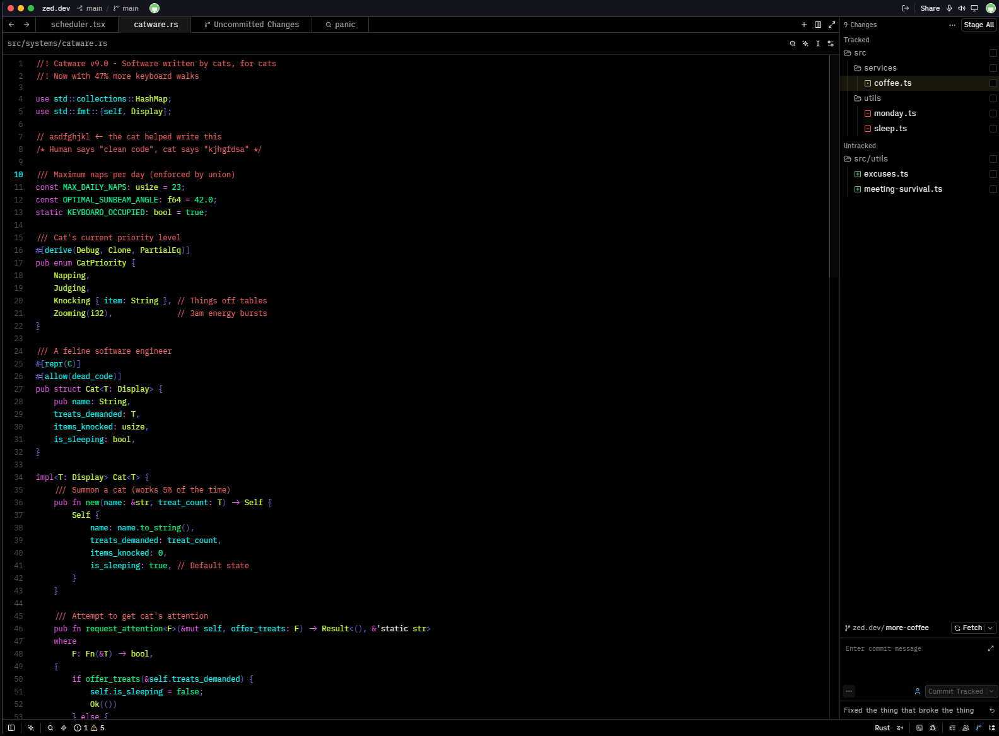
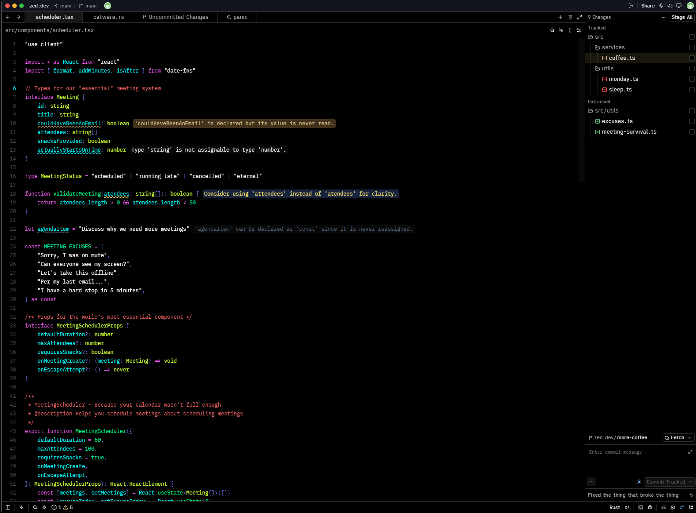
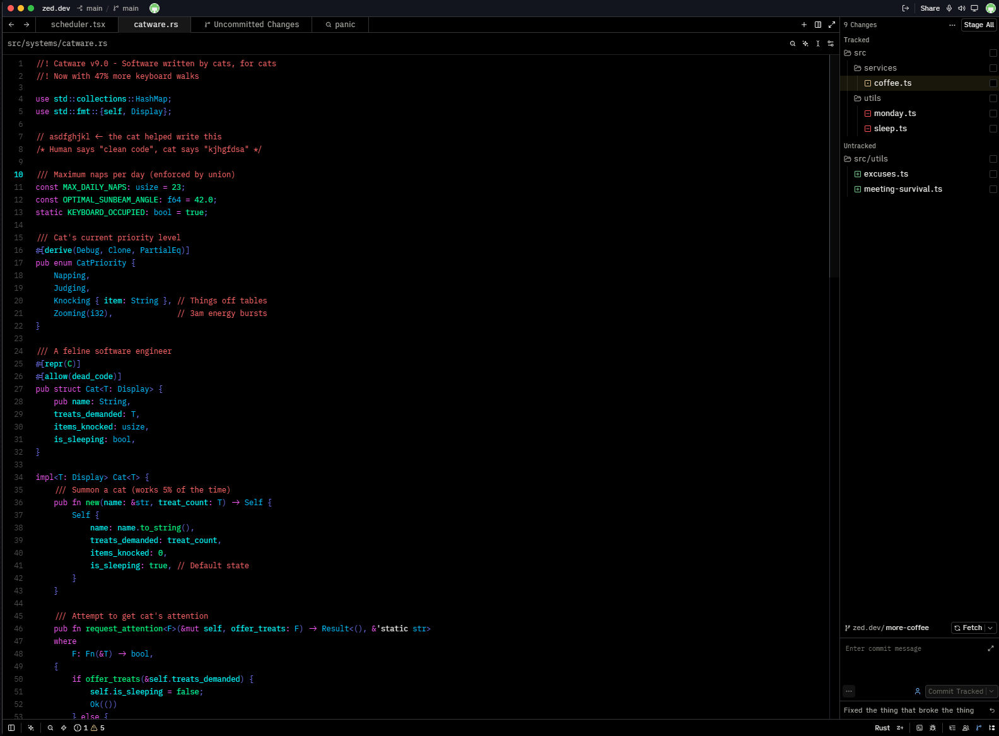
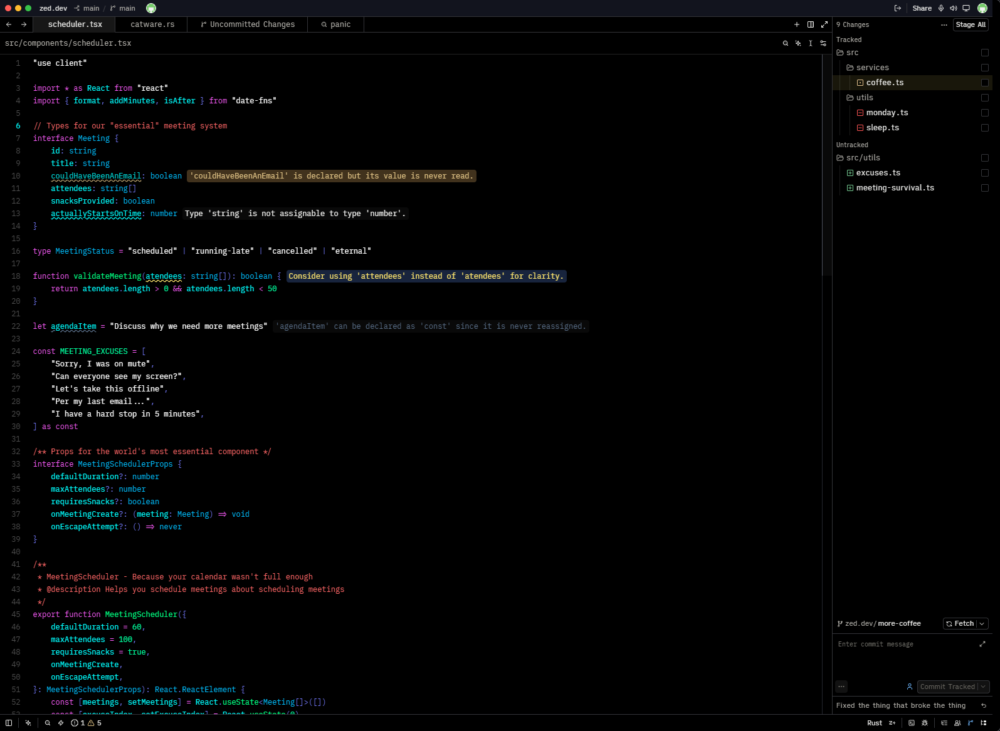

# ratveteinn

A high-contrast dark theme for [Zed](https://zed.dev), built around deep blacks, bright syntax colors, and extremely clear visual hierarchy.

## Themes

### ratveteinn

The original theme, with maximum contrast for prominent syntax elements.

### ratveteinn azure

A slightly softer variant that de-emphasizees types, enums, namespaces, and variants.

## Installation

Install **ratveteinn** from the Zed Extensions marketplace:

1. Open Zed.
2. Open the Extensions page.
3. Search for `ratveteinn`.
4. Click **Install**.
5. Select either `ratveteinn` or `ratveteinn Azure` from the theme selector.

## Development

To install the theme locally:

1. Clone this repository.
2. In Zed, open the Extensions page.
3. Click **Install Dev Extension**.
4. Select the root directory of this repository.

## License

MIT
